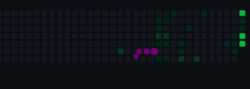

# 👋 Hi there, I'm Du Bao Nhan

I'm a **Front-End Developer (Fresher)** passionate about creating responsive and high-performance web applications using **React**, **Angular**, and **TypeScript**.  
I enjoy turning creative ideas into functional user interfaces, optimizing performance, and continuously learning new technologies to improve my craft.

---

## 🚀 Summary
- 🌱 Front-end developer with 2+ years of experience in **JavaScript (ES6+)** and 1 year with **TypeScript**.  
- 💻 Skilled in building and deploying **React** and **Angular** applications with CRUD operations and state management (**React Query**, **Zustand**).  
- 🧩 Experienced in developing responsive UIs using **Tailwind CSS**, **SCSS**, and **Bootstrap**.  
- ⚙️ Basic understanding of back-end development with **Node.js**, **Express**, and **MongoDB**.  
- 🎯 Passionate about UI/UX, clean code, and performance optimization.  

---

## 💡 Tech Stack
**Languages:** JavaScript (ES6+), TypeScript  
**Frameworks:** React, Angular  
**State Management:** React Query, Zustand  
**Styling:** SCSS, Tailwind CSS, Bootstrap, Responsive Design  
**Back-End (Basic):** Node.js, Express, MongoDB  
**Tools:** Git/GitHub, Postman, Netlify, VS Code, ChatGPT  

---

## 🧠 Projects

### 🛒 [Shopee Interface Clone (ReactJS)](https://github.com/Mohick/Clone-Shopee)
*May 2024 – July 2024*  
- Built main marketplace UI with product listing, search/filter, and shopping cart.  
- Implemented responsive design using **Tailwind CSS** and **SCSS**.  
- **Tech:** React, TypeScript, SCSS, Tailwind  
- [Demo](https://clone-shopee-dnb.netlify.app)

---

### 📚 [Store Book (Angular)](https://github.com/Mohick/Store-Book)
*March 2025*  
- Implemented **lazy loading** and **pagination** to optimize performance.  
- Added dynamic banner sliders and search features for a smooth user experience.  
- **Tech:** Angular, TypeScript, Tailwind CSS, Mock DB  

---

## 🎓 Education
**College of Information Technology – Ho Chi Minh City**  
*Major: Web Design (2024 – 2026, Expected)*  

---

## 🎯 Career Goals
- **Short-Term:** Gain real-world experience from projects and apply my knowledge effectively in professional environments.  
- **Long-Term:** Become a **Full-Stack Developer**, capable of working across both front-end and back-end technologies.  

---

## 🌐 Connect with Me
- 📫 Email: [haokietks7@gmail.com](mailto:haokietks7@gmail.com)  
- 💼 GitHub: [github.com/Mohick](https://github.com/Mohick)  
- 🌍 Location: Hoa Thanh – Tan Phu – Ho Chi Minh City, Vietnam  

---

⭐ *“Building intuitive, efficient, and scalable web applications one project at a time.”*

